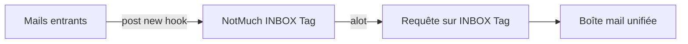
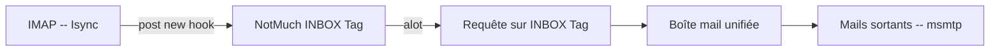

J'étais un utilisateur très satisfait de claws-mail [liens] (ou sylpheed) tant que je n'avais qu'une seule boîte mail. La multiplication et diversification de mes activités professionnelles et associatives ainsi que la quasi-obligation d'avoir un compte chez gmail pour accéder à certains services font que je me retrouve (selon les saison) avec un minimum de trois boîtes mails actives. Inutile de préciser que l'utilisation de webmail n'est pour moi qu'une solution de secours d'autant qu'il est plus pratique d'avoir un outils dédier aux mails, et non pas un ou plusieurs onglets perdu quelques part dans la forêt d'onglets qu'est mon navigateur. Mais surtout, ce que je voulais, c'est un lecteur de mail qui me propose une vue unifiée de l'ensemble de mes boîtes mails (en IMAP). Voir en un coup d'oeil l'ensemble des mails de mes boîtes de réception et pouvoir y répondre ou agir sur un mail en cliquant un minimum (avec une synchronisation totale de ce qui est fait en local et de ce qu'il y a sur le serveur). Je n'ai pas trouvé de lecteurs de mails graphiques ni réussi à configurer mon lecteur préféré (claws-mail) afin d'obtenir ce résultat. Je me suis alors tourné vers des solutions en mode console, d'autant plus que je recherche de plus en plus ce type de solutions, surtout quand elles sont bien pensées.

# Alpine & Mutt

Dans un premier temps, j'ai essayé des logiciels de référence dans ce domaine, à savoir Alpine [liens] & Mutt [liens]. Effectivement, ces logiciels sont bien pensés et font tout ce que l'on peu attendre d'un lecteur de mail. La configuration peut paraître un peu fastidieuse, mais bon quand c'est fait, c'est fait. Ma préférence entre les deux va à Mutt. Mais que ce soit pour l'un ou pour l'autre, la configuration d'une boîte mail unifiée est très (trop) complexe et je n'ai pas réussi à me faire un Mutt aux petits oignions.

#  Notmuch & Alot 

[NotMuch](https://notmuchmail.org/) est un logiciel qui ne fait qu'une toute petite chose : il tag vos mails. Il enregistre où sont ranger vos fichiers mails, les indexe et leur appose un tag en fonction de règle que vous écrivez. Le logiciel [a few](https://afew.readthedocs.io/en/latest/) permet d'écrire ces règles de façons un peu plus simple que ne le permet notMuch, mais le principe reste le même. Il possède un puissant moteur de recherche qui vous permet de faire des recherche en utilisant ces tag, mais également les dates des mails ou d'autres attributs. Si vous recevez des mails de plusieurs adresses, que vous taggez tout ces mails entrants avec notMuch sur par exemple un tag INBOX (vous en plus leurs donner un tag par adresse mail), puis que vous faîtes une requête à notMuch sur le tag INBOX, vous avez **Une boîte mail unifiée** !! Youpi!

Il ne reste plus qu'un logiciel front-end pour afficher les mails et les gérer en utilisant les tags de notMuch. Mutt le fait, mais c'est encore une fois compliqué à configurer. Le logiciel [aLot](http://alot.readthedocs.io/) par contre fait cela très bien, mais alors vraiment bien de façons simple et élégante.

## NotMuch -- config

La config de NotMuch se fait en 2 parties : la confiuration générale qui est assez basique, et un hook qui permet de tagger les nouveaux mails

### post-new Hook

La partie spam ne marche pas pour l'instant. C'est une config simple qui me permet d'avoir une INBOX unifiée et une INBOX par adresse mail également. NotMuch peut vous permettre également de tagger et donc de retrouver simplement les mails de mailing list ou d'un expéditeur particulier.

`
#!/bin/bash
export NOTSPAM_CLASSIFIER=spamassassin
export NOTSPAM_LOG=/home/XXXXX/script/notspam/spamlog-classify.log

echo "starting post-new…"

notmuch tag +tome -new  +sent -- tag:new AND from:XXXXX@developont.fr AND \( to:XXXXX@free.fr OR to:XXXXX@developont.fr OR to:XXXXX@gmail.com \)
notmuch tag +tome -new  +sent -- tag:new AND from:XXXXX@free.fr AND \( to:XXXXX@free.fr OR to:XXXXX@developont.fr OR to:XXXXXr@gmail.com \)
notmuch tag +tome -new  +sent -- tag:new AND from:XXXXX@gmail.com AND \( to:XXXXX@free.fr OR to:XXXXX@developont.fr OR to:XXXXX@gmail.com \)

# immediately archive all messages from "me"
notmuch tag -new +sent -- tag:new and from:XXXXX@free.fr 

notmuch tag -new +sent -- tag:new and from:XXXXXr@gmail.com

notmuch tag -new +sent -- tag:new and from:XXXXX@developont.fr

sh /home/psic/script/notspam/notspam classify --spam=spamd tag:new  &>> /home/psic/script/notspam/spamlog-classify.log

notmuch tag +inbox -new -- tag:new

notmuch tag +inbox -- tag:tome

notmuch tag +free -- tag:inbox and to:XXXXX@free.fr

notmuch tag +gmail -- tag:inbox and to:XXXXX@gmail.com

notmuch tag +dvlp -- tag:inbox and to:XXXXX@developont.fr

notmuch tag +dvlp -- tag:inbox and to:XXXXX@developont.fr

notmuch tag +dvlp -- tag:inbox and to:XXXXX@developont.fr

notmuch tag +archive -inbox -- date:..60d and tag:free
notmuch tag +archive -inbox -- date:..60d and tag:gmail
notmuch tag +archive -inbox -- date:..300d and tag:dvlp

echo "post-new complete; goodbye"
`

### Config générale

`
[database]
path=/home/.../.notmuch/mail/

[user]
name=MyName
primary_email=xxxx@developont.fr
other_email=xxxxx@gmail.com;xxx@free.fr;

[new]
tags=new;
ignore=

[search]
exclude_tags=deleted;spam;

[maildir]
synchronize_flags=true

[crypto]
gpg_path=gpg
`

##  Alot -- config

GGGGGGg

# Isync & Msmtp

## Isync -- config

## Msmtp -- config

# TODO
 Avoir une gestion de l'adresse book directement depuis alot.
 Avoir une solution de spam efficace.
