J'étais un utilisateur très satisfait de claws-mail [liens] (ou sylpheed) tant que je n'avais qu'une seule boîte mail. La multiplication et diversification de mes activités professionnelles et associatives ainsi que la quasi-obligation d'avoir un compte chez gmail pour accéder à certains services font que je me retrouve (selon les saison) avec un minimum de trois boîtes mails actives. Inutile de préciser que l'utilisation de webmail n'est pour moi qu'une solution de secours d'autant qu'il est plus pratique d'avoir un outils dédier aux mails, et non pas un ou plusieurs onglets perdu quelques part dans la forêt d'onglets qu'est mon navigateur. Mais surtout, ce que je voulais, c'est un lecteur de mail qui me propose une vue unifiée de l'ensemble de mes boîtes mails (en IMAP). Voir en un coup d'oeil l'ensemble des mails de mes boîtes de réception et pouvoir y répondre ou agir sur un mail en cliquant un minimum (avec une synchronisation totale de ce qui est fait en local et de ce qu'il y a sur le serveur). Je n'ai pas trouvé de lecteurs de mails graphiques ni réussi à configurer mon lecteur préféré (claws-mail) afin d'obtenir ce résultat. Je me suis alors tourné vers des solutions en mode console, d'autant plus que je recherche de plus en plus ce type de solutions, surtout quand elles sont bien pensées.

# Alpine & Mutt

Dans un premier temps, j'ai essayé des logiciels de référence dans ce domaine, à savoir Alpine [liens] & Mutt [liens]. Effectivement, ces logiciels sont bien pensés et font tout ce que l'on peu attendre d'un lecteur de mail. La configuration peut paraître un peu fastidieuse, mais bon quand c'est fait, c'est fait. Ma préférence entre les deux va à Mutt. Mais que ce soit pour l'un ou pour l'autre, la configuration d'une boîte mail unifiée est très (trop) complexe et je n'ai pas réussi à me faire un Mutt aux petits oignions.

#  Notmuch & Alot 

[NotMuch](https://notmuchmail.org/) est un logiciel qui ne fait qu'une toute petite chose : il tag vos mails. Il enregistre où sont ranger vos fichiers mails, les indexe et leur appose un tag en fonction de règle que vous écrivez. Le logiciel [a few](https://afew.readthedocs.io/en/latest/) permet d'écrire ces règles de façons un peu plus simple que ne le permet notMuch, mais le principe reste le même. Il possède un puissant moteur de recherche qui vous permet de faire des recherche en utilisant ces tag, mais également les dates des mails ou d'autres attributs. Si vous recevez des mails de plusieurs adresses, que vous taggez tout ces mails entrants avec notMuch sur par exemple un tag INBOX (vous en plus leurs donner un tag par adresse mail), puis que vous faîtes une requête à notMuch sur le tag INBOX, vous avez **Une boîte mail unifiée** !! Youpi!

```mermaid
graph LR;
    A[Mails entrants]
    B[NotMuch INBOX Tag]
    C[Requête sur INBOX Tag]
    D[Boîte mail unifiée]
    A--post new hook-->B;
    B--alot-->C;
    C-->D;
```

Il ne reste plus qu'un logiciel front-end pour afficher les mails et les gérer en utilisant les tags de notMuch. Mutt le fait, mais c'est encore une fois compliqué à configurer. Le logiciel [aLot](http://alot.readthedocs.io/) par contre fait cela très bien, mais alors vraiment bien de façons simple et élégante.

## NotMuch -- config

La config de NotMuch se fait en 2 parties : la configuration générale qui est assez basique, et un hook qui permet de tagger les nouveaux mails

### Config générale

Dans la config générale de notMuch, on configure l'endroit où sera stocké la base de données de mails, ses informations personnelles : son nom et ses différentes adresses mails, les tags à ignorer pour les recherche (ici, les mails portant les tags *deleted* et *spam* seront ignorés) et enfin le ou les tags que porteront les mails entrants (ici, *new*).

~~~~
[database]
path=/home/.../.notmuch/mail/

[user]
name=MyName
primary_email=xxxx@developont.fr
other_email=xxxxx@gmail.com;xxx@free.fr;

[new]
tags=new;
ignore=

[search]
exclude_tags=deleted;spam;

[maildir]
synchronize_flags=true

[crypto]
gpg_path=gpg
~~~~

### post-new Hook

La logique est la suivante : les mails arrivent avec un tag *new*. En fonction de leur expéditeurs et/ou destinataire, on enlève ce tag pour le remplacer par un ou plusieurs tags appropriés : *inbox*,*free*,*gmail*,*spam*,*archive*,...
La partie spam ne marche pas pour l'instant. C'est une config simple qui me permet d'avoir une INBOX unifiée et une INBOX par adresse mail également. NotMuch peut vous permettre également de tagger et donc de retrouver simplement les mails de mailing list ou d'un expéditeur particulier.

~~~~
#!/bin/bash
export NOTSPAM_CLASSIFIER=spamassassin
export NOTSPAM_LOG=/home/XXXXX/script/notspam/spamlog-classify.log

echo "starting post-new…"

notmuch tag +tome -new  +sent -- tag:new AND from:XXXXX@developont.fr AND \( to:XXXXX@free.fr OR to:XXXXX@developont.fr OR to:XXXXX@gmail.com \)
notmuch tag +tome -new  +sent -- tag:new AND from:XXXXX@free.fr AND \( to:XXXXX@free.fr OR to:XXXXX@developont.fr OR to:XXXXXr@gmail.com \)
notmuch tag +tome -new  +sent -- tag:new AND from:XXXXX@gmail.com AND \( to:XXXXX@free.fr OR to:XXXXX@developont.fr OR to:XXXXX@gmail.com \)

# immediately archive all messages from "me"
notmuch tag -new +sent -- tag:new and from:XXXXX@free.fr 

notmuch tag -new +sent -- tag:new and from:XXXXXr@gmail.com

notmuch tag -new +sent -- tag:new and from:XXXXX@developont.fr

sh /home/psic/script/notspam/notspam classify --spam=spamd tag:new  &>> /home/psic/script/notspam/spamlog-classify.log

notmuch tag +inbox -new -- tag:new

notmuch tag +inbox -- tag:tome

notmuch tag +free -- tag:inbox and to:XXXXX@free.fr

notmuch tag +gmail -- tag:inbox and to:XXXXX@gmail.com

notmuch tag +dvlp -- tag:inbox and to:XXXXX@developont.fr

notmuch tag +dvlp -- tag:inbox and to:XXXXX@developont.fr

notmuch tag +dvlp -- tag:inbox and to:XXXXX@developont.fr

notmuch tag +archive -inbox -- date:..60d and tag:free
notmuch tag +archive -inbox -- date:..60d and tag:gmail
notmuch tag +archive -inbox -- date:..300d and tag:dvlp

echo "post-new complete; goodbye"
~~~~

##  Alot -- config

La config d'alot consiste à définir les différents comptes mails que l'on veut gérer en décrivant : le nom de l'utilisateur, son mail, la commande pour envoyer un mail avec ce compte, les répertoires pour stocker les messages envoyés et les brouillons. On définit également dans cette config ses raccourcis clavier ainsi que différents icône ou style particulier pour des attributs de certains mails (avec attachement, répondu, spam, ...)

~~~~
theme=solarized_dark
editor_cmd="vim +4 -u ~/.vimrc_forMutt +startinsert"
[accounts]
    [[free]]
        realname =XXXXX
        address = XXXXX@free.fr
        sendmail_command = /usr/bin/msmtp -a free -t
        sent_box = maildir:///home/XXXXX/Mail/.notmuch/mail/free/Sent
        draft_box = maildir:///home/XXXXX/Mail/.notmuch/mail/free/Drafts
        [[[abook]]]
        type = abook

    [[dvp]]
        realname = XXXXX
        address = XXXXX@developont.fr
        sendmail_command = /usr/bin/msmtp -a developont -t
		sent_box = maildir:///home/XXXXX/Mail/.notmuch/mail/developont/Sent
        draft_box = maildir:///home/XXXXX/Mail/.notmuch/mail/developont/Drafts
        [[[abook]]]
        type = abook

	[[gmail]]
        realname = XXXXX
        address = XXXXX@gmail.com
        sendmail_command = /usr/bin/msmtp -a gmail -t
		sent_box = maildir:///home/XXXXX/Mail/.notmuch/mail/gmail/Sent
        draft_box = maildir:///home/XXXXX/Mail/.notmuch/mail/gmail/Drafts
        [[[abook]]]
        type = abook

[bindings]
	[[search]]
		s = toggletags spam;move down
		h = toggletags ham;move down
		r = toggletags deleted;move down
		f1 = search tag:inbox AND NOT tag:killed AND tag:free
		f2 = search tag:inbox AND NOT tag:killed AND tag:gmail
		f3 = search tag:inbox AND NOT tag:killed AND tag:dvlp
		f4 = search tag:inbox AND NOT tag:killed AND tag:spam AND tab:free
		f5 = search tag:inbox AND NOT tag:killed AND tag:spam AND tag:deleted AND tag:free
		f6 = search tag:inbox AND NOT tag:killed AND tag:deleted AND tag:free

[tags]

  [[flagged]]
    translated = ⚑
    normal = '','','light red','','light red',''
    focus = '','','light red','','light red',''

  [[unread]]
#    translated = ✉
	   translated = ''
	
  [[replied]]
    #translated = ⏎⮠↩
	translated = ↩
	normal = '','','dark green,bold','','white, bold',''
	[[sent]]
	translated = ↗
	normal = '','','dark green,bold','','white, bold',''
  [[encrypted]]
    translated = ⚷
  
  [[spam]]
   translated = ☣
    normal = '','','dark green','','dark green',''
    focus = '','','dark green','','dark green',''
    
  [[attachment]]
   translated = 📎
   
  [[inbox]]
  translated = ''
  
   [[free]]
  translated = ''
  
   [[dvlp]]
  translated = ''
  
   [[gmail]]
  translated = ''
  
     [[signed]]
  translated = ''
~~~~

## Alot -- theme

Ci-dessous, le thème qui définit un style différent pour chaque ligne (mail) en fonction de son appartenance à une compte mail.

base03 = 'dark gray'
base02 = 'black'
base01 = 'light green'
base00 = 'yellow'
base0 = 'default'
base1 = 'dark gray'
base2 = 'light gray'
base3 = 'white'
yellow = 'brown'
orange = 'light red'
red = 'dark red'
magenta = 'dark magenta'
violet = 'light magenta'
blue = 'dark blue'
cyan = 'dark cyan'
green = 'dark green'

[global]
    footer = 'standout','default','%(base0)s','%(base02)s','%(base0)s','%(base02)s'
    body = 'default','default','%(base0)s','%(base03)s','%(base0)s','%(base03)s'
    notify_error = 'standout','default','%(base3)s','%(red)s','%(base3)s','%(red)s'
    notify_normal = 'default','default','%(blue)s','%(base02)s','%(blue)s','%(base02)s'
    prompt = 'default','default','%(base0)s','%(base02)s','%(base0)s','%(base02)s'
    tag = 'default','default','%(yellow)s','%(base03)s','%(yellow)s','%(base03)s'
    tag_focus = 'standout','default','%(base03)s','%(yellow)s','%(base03)s','%(yellow)s'
[help]
    text = 'default','default','%(base0)s','%(base02)s','%(base0)s','%(base02)s'
    section = 'underline','default','%(cyan)s,bold','%(base02)s','%(cyan)s,bold','%(base02)s'
    title = 'standout','default','%(yellow)s','%(base02)s','%(yellow)s','%(base02)s'
    frame = 'standout','default','%(base1)s','%(base02)s','%(base1)s,bold','%(base02)s'
[taglist]
    line_even = 'default','default','%(base0)s','%(base02)s','%(base0)s','%(base02)s'
    line_focus = 'standout','default','%(base1)s','%(base01)s','%(base1)s','%(base01)s'
    line_odd = 'default','default','%(base0)s','%(base03)s','%(base0)s','%(base03)s'
[bufferlist]
    line_even = 'default','default','%(base0)s','%(base02)s','%(base0)s','%(base02)s'
    line_focus = 'standout','default','%(base1)s','%(base01)s','%(base1)s','%(base01)s'
    line_odd = 'default','default','%(base0)s','%(base03)s','%(base0)s','%(base03)s'
[thread]
    attachment = 'default','default','%(base0)s','%(base03)s','%(base0)s','%(base03)s'
    attachment_focus = 'underline','default','%(base02)s','%(yellow)s','%(base02)s','%(yellow)s'
    arrow_bars = 'default','default','%(yellow)s','%(base03)s','%(yellow)s','%(base03)s'
    arrow_heads = 'default','default','%(yellow)s','%(base03)s','%(yellow)s','%(base03)s'
    body = 'default','default','%(base0)s','%(base03)s','%(base0)s','%(base03)s'
    body_focus = 'default','default','%(base0)s','%(base02)s','%(base0)s','%(base02)s'
    header = 'default','default','%(base0)s','%(base03)s','%(base0)s','%(base03)s'
    header_key = 'default','default','%(red)s','%(base03)s','%(red)s','%(base03)s'
    header_value = 'default','default','%(blue)s','%(base03)s','%(blue)s','%(base03)s'
    [[summary]]
      even = 'default','default','%(base0)s','%(base02)s','%(base0)s','%(base02)s'
      focus = 'standout','default','%(base1)s','%(base01)s','%(base1)s','%(base01)s'
      odd = 'default','default','%(base0)s','%(base03)s','%(base0)s','%(base03)s'
[envelope]
    body = 'default','default','%(base0)s','%(base03)s','%(base0)s','%(base03)s'
    header = 'default','default','%(base0)s','%(base03)s','%(base0)s','%(base03)s'
    header_key = 'default','default','%(red)s','%(base03)s','%(red)s','%(base03)s'
    header_value = 'default','default','%(blue)s','%(base03)s','%(blue)s','%(base03)s'
[search]
    [[threadline]]
        normal = 'default','default','%(base1)s','%(base03)s','%(base1)s','%(base03)s'
        focus = 'standout','default','%(base02)s','%(base01)s','%(base02)s','%(base01)s'
        parts = date,mailcount,authors,subject,tags
        [[[date]]]
            normal = 'default','default','%(yellow)s','%(base03)s','%(yellow)s','%(base03)s'
            focus = 'standout','default','%(base02)s,bold','%(base01)s','%(base02)s,bold','%(base01)s'
            alignment = right
            width = fit, 9, 9
        [[[mailcount]]]
            normal = 'default','default','%(blue)s','%(base03)s','%(blue)s','%(base03)s'
            focus = 'standout','default','%(base02)s','%(base01)s','%(base02)s','%(base01)s'
        [[[tags]]]
            normal = 'default','default','%(cyan)s','%(base03)s','%(cyan)s','%(base03)s'
            focus = 'standout','default','%(base02)s','%(base01)s','%(base02)s','%(base01)s'
        [[[authors]]]
            normal = 'default,underline','default','%(blue)s','%(base03)s','%(blue)s','%(base03)s'
            focus = 'standout','default','%(base02)s','%(base01)s','%(base02)s','%(base01)s'
            width = 'fit',0,30
        [[[subject]]]
            normal = 'default','default','%(base0)s','%(base03)s','%(base0)s','%(base03)s'
            focus = 'standout','default','%(base02)s,bold','%(base01)s','%(base02)s,bold','%(base01)s'
            width = 'weight',1
        [[[content]]]
            normal = 'default','default','%(base01)s','%(base03)s','%(base01)s','%(base03)s'
            focus = 'standout','default','%(base02)s','%(base01)s','%(base02)s','%(base01)s'
	
	 [[threadline-unread-free]]
      tagged_with = 'unread','free'
       #query = 'tag:unread AND tag:free'
       		[[[date]]]
            normal = 'default','default','%(yellow)s','%(base03)s','%(base00)s','%(base03)s'
            [[[mailcount]]]
	         normal = 'default','default','%(base02)s','%(base03)s','%(base02)s,bold','%(base01)s'
	[[threadline-unread-gmail]]
      tagged_with = 'unread','gmail'
       #query = 'tag:unread AND tag:free'
       		[[[date]]]
            normal = 'default','default','%(yellow)s','%(base03)s','%(base00)s','%(base03)s'
            [[[mailcount]]]
	         normal = 'default','default','%(green)s,bold','%(base03)s','%(base02)s,bold','%(green)s'
	         	
	 [[threadline-unread-dvlp]]
      tagged_with = 'unread','dvlp'
       #query = 'tag:unread AND tag:free'
       		[[[date]]]
            normal = 'default','default','%(yellow)s','%(base03)s','%(base00)s','%(base03)s'
            [[[mailcount]]]
	         normal = 'default','default','%(green)s,bold','%(base03)s','%(base02)s,bold','%(green)s'
	         
	 [[threadline-unread-rest]]
      tagged_with = 'unread'
       #query = 'tag:unread AND tag:free'
       		[[[date]]]
            normal = 'default','default','%(yellow)s','%(base03)s','%(base00)s','%(base03)s'
            [[[mailcount]]]
	        normal = 'default','default','%(blue)s','%(base03)s','%(blue)s','%(base03)s'

  	
	   [[threadline-free]]
       		tagged_with = 'free'
       		[[[mailcount]]]
	         normal = 'default','default','%(base02)s','%(base03)s','%(base02)s,bold','%(base01)s'
	         
	   [[threadline-gmail]]
       		tagged_with = 'gmail'
       		[[[mailcount]]]
	         normal = 'default','default','%(green)s,bold','%(base03)s','%(base02)s,bold','%(yellow)s'
	   [[threadline-dvlp]]
      		tagged_with = 'dvlp'
       		[[[mailcount]]]
	         normal = 'default','default','%(green)s,bold','%(base03)s','%(base02)s,bold','%(green)s'

	   [[threadline-flag]]
       tagged_with = 'flagged'
       		[[[tags]]]
	         	normal = 'default','default','%(red)s,bold','%(base03)s','%(red)s,bold','%(blue)s'
	     
~~~~

# Isync & Msmtp

```mermaid
graph LR;
    A[IMAP -- Isync]
    B[NotMuch INBOX Tag]
    C[Requête sur INBOX Tag]
    D[Boîte mail unifiée]
    E[Mails sortants -- msmtp]
    A--post new hook-->B;
    B--alot-->C;
    C-->D;
    D-->E;
```

## Isync -- config

~~~~
IMAPAccount gmail
# Address to connect to
Host imap.gmail.com
User XXXXX@gmail.com
Pass XXXXXX
AuthMechs LOGIN
SSLType IMAPS

IMAPStore gmail-remote
Account gmail

MaildirStore gmail-local
Path ~/Mail/.notmuch/mail/gmail/
Inbox ~/Mail/.notmuch/mail/gmail/INBOX

Channel gmail
Master :gmail-remote:
Slave :gmail-local:
Patterns *
Create Both
Expunge Both
SyncState *

IMAPAccount developont
# Address to connect to
Host mail.developont.fr
User XXXXXX
Pass XXXXXX
AuthMechs LOGIN
SSLType IMAPS

CertificateFile ~/.cert/mail.developont.pem

IMAPStore developont-remote
Account developont

MaildirStore developont-local
Path ~/Mail/.notmuch/mail/developont/
Inbox ~/Mail/.notmuch/mail/developont/INBOX

Channel developont
Master :developont-remote:
Slave :developont-local:
Patterns *
Create Both
Expunge Both
SyncState *

IMAPAccount free
# Address to connect to
Host imap.free.fr
User XXXXXX@free.fr
Pass XXXXXX
AuthMechs LOGIN
SSLType None

IMAPStore free-remote
Account free

MaildirStore free-local
Path ~/Mail/.notmuch/mail/free/
Inbox ~/Mail/.notmuch/mail/free/INBOX

Channel free
Master :free-remote:
Slave :free-local:
#Patterns "INBOX" "[Gmail]/Sent Mail" "[Gmail]/Drafts" "[Gmail]/Starred"
Patterns *
Create Both
Expunge Both
SyncState *

~~~~

~~~~
#!/bin/bash

/usr/bin/mbsync -a
/usr/bin/notmuch new
~~~~

## Msmtp -- config

~~~~
defaults
logfile        ~/.msmtp.log

account gmail
tls on
host smtp.gmail.com
port 587
from XXXXXX@gmail.com
auth on
user XXXXXX
password XXXXXX
tls_starttls on
tls_certcheck on
tls_trust_file /etc/ssl/certs/ca-certificates.crt

account free
host smtp.free.fr
from XXXXXX@free.fr
tls on
auth on
port 465
user XXXXXX
password XXXXXX
tls_starttls off
tls_certcheck off

account developont 
host developont.fr
tls on
from XXXXXX@developont.fr
auth on
port 465
user XXXXXX
password XXXXXX
tls_starttls off
tls_certcheck off

account default : developont 
~~~~

# TODO

+ Avoir une gestion de l'adresse book directement depuis alot.
+ Avoir une solution de spam efficace.
